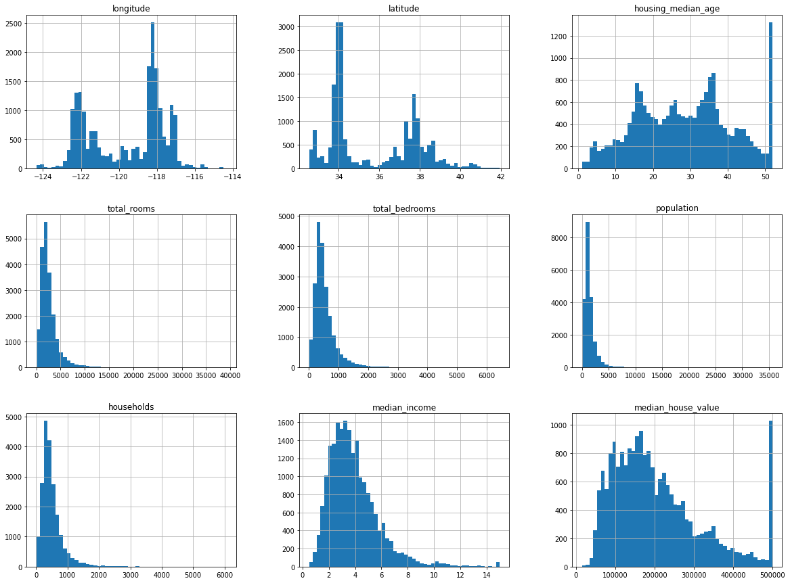
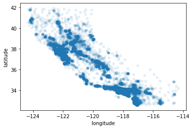
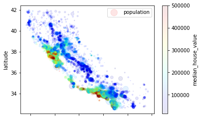
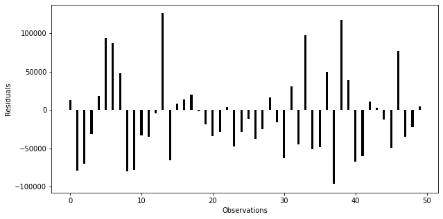

# California Housing Prices Analysis

```python
import numpy as np
import pandas as pd
import matplotlib.pyplot as plt
```


```python
housing = pd.read_csv("housing.csv")
```


```python
housing.head()
```


<div>
<style scoped>
    .dataframe tbody tr th:only-of-type {
        vertical-align: middle;
    }

    .dataframe tbody tr th {
        vertical-align: top;
    }

    .dataframe thead th {
        text-align: right;
    }
</style>
<table border="1" class="dataframe">
  <thead>
    <tr style="text-align: right;">
      <th></th>
      <th>longitude</th>
      <th>latitude</th>
      <th>housing_median_age</th>
      <th>total_rooms</th>
      <th>total_bedrooms</th>
      <th>population</th>
      <th>households</th>
      <th>median_income</th>
      <th>median_house_value</th>
      <th>ocean_proximity</th>
    </tr>
  </thead>
  <tbody>
    <tr>
      <th>0</th>
      <td>-122.23</td>
      <td>37.88</td>
      <td>41.0</td>
      <td>880.0</td>
      <td>129.0</td>
      <td>322.0</td>
      <td>126.0</td>
      <td>8.3252</td>
      <td>452600.0</td>
      <td>NEAR BAY</td>
    </tr>
    <tr>
      <th>1</th>
      <td>-122.22</td>
      <td>37.86</td>
      <td>21.0</td>
      <td>7099.0</td>
      <td>1106.0</td>
      <td>2401.0</td>
      <td>1138.0</td>
      <td>8.3014</td>
      <td>358500.0</td>
      <td>NEAR BAY</td>
    </tr>
    <tr>
      <th>2</th>
      <td>-122.24</td>
      <td>37.85</td>
      <td>52.0</td>
      <td>1467.0</td>
      <td>190.0</td>
      <td>496.0</td>
      <td>177.0</td>
      <td>7.2574</td>
      <td>352100.0</td>
      <td>NEAR BAY</td>
    </tr>
    <tr>
      <th>3</th>
      <td>-122.25</td>
      <td>37.85</td>
      <td>52.0</td>
      <td>1274.0</td>
      <td>235.0</td>
      <td>558.0</td>
      <td>219.0</td>
      <td>5.6431</td>
      <td>341300.0</td>
      <td>NEAR BAY</td>
    </tr>
    <tr>
      <th>4</th>
      <td>-122.25</td>
      <td>37.85</td>
      <td>52.0</td>
      <td>1627.0</td>
      <td>280.0</td>
      <td>565.0</td>
      <td>259.0</td>
      <td>3.8462</td>
      <td>342200.0</td>
      <td>NEAR BAY</td>
    </tr>
  </tbody>
</table>
</div>


```python
housing.shape
```


    (20640, 10)


```python
housing.info()
```

    <class 'pandas.core.frame.DataFrame'>
    RangeIndex: 20640 entries, 0 to 20639
    Data columns (total 10 columns):
     #   Column              Non-Null Count  Dtype  
    ---  ------              --------------  -----  
     0   longitude           20640 non-null  float64
     1   latitude            20640 non-null  float64
     2   housing_median_age  20640 non-null  float64
     3   total_rooms         20640 non-null  float64
     4   total_bedrooms      20433 non-null  float64
     5   population          20640 non-null  float64
     6   households          20640 non-null  float64
     7   median_income       20640 non-null  float64
     8   median_house_value  20640 non-null  float64
     9   ocean_proximity     20640 non-null  object 
    dtypes: float64(9), object(1)
    memory usage: 1.6+ MB
    


```python
housing['ocean_proximity'].value_counts()
```


    <1H OCEAN     9136
    INLAND        6551
    NEAR OCEAN    2658
    NEAR BAY      2290
    ISLAND           5
    Name: ocean_proximity, dtype: int64


```python
housing.describe()
```


<div>
<style scoped>
    .dataframe tbody tr th:only-of-type {
        vertical-align: middle;
    }

    .dataframe tbody tr th {
        vertical-align: top;
    }

    .dataframe thead th {
        text-align: right;
    }
</style>
<table border="1" class="dataframe">
  <thead>
    <tr style="text-align: right;">
      <th></th>
      <th>longitude</th>
      <th>latitude</th>
      <th>housing_median_age</th>
      <th>total_rooms</th>
      <th>total_bedrooms</th>
      <th>population</th>
      <th>households</th>
      <th>median_income</th>
      <th>median_house_value</th>
    </tr>
  </thead>
  <tbody>
    <tr>
      <th>count</th>
      <td>20640.000000</td>
      <td>20640.000000</td>
      <td>20640.000000</td>
      <td>20640.000000</td>
      <td>20433.000000</td>
      <td>20640.000000</td>
      <td>20640.000000</td>
      <td>20640.000000</td>
      <td>20640.000000</td>
    </tr>
    <tr>
      <th>mean</th>
      <td>-119.569704</td>
      <td>35.631861</td>
      <td>28.639486</td>
      <td>2635.763081</td>
      <td>537.870553</td>
      <td>1425.476744</td>
      <td>499.539680</td>
      <td>3.870671</td>
      <td>206855.816909</td>
    </tr>
    <tr>
      <th>std</th>
      <td>2.003532</td>
      <td>2.135952</td>
      <td>12.585558</td>
      <td>2181.615252</td>
      <td>421.385070</td>
      <td>1132.462122</td>
      <td>382.329753</td>
      <td>1.899822</td>
      <td>115395.615874</td>
    </tr>
    <tr>
      <th>min</th>
      <td>-124.350000</td>
      <td>32.540000</td>
      <td>1.000000</td>
      <td>2.000000</td>
      <td>1.000000</td>
      <td>3.000000</td>
      <td>1.000000</td>
      <td>0.499900</td>
      <td>14999.000000</td>
    </tr>
    <tr>
      <th>25%</th>
      <td>-121.800000</td>
      <td>33.930000</td>
      <td>18.000000</td>
      <td>1447.750000</td>
      <td>296.000000</td>
      <td>787.000000</td>
      <td>280.000000</td>
      <td>2.563400</td>
      <td>119600.000000</td>
    </tr>
    <tr>
      <th>50%</th>
      <td>-118.490000</td>
      <td>34.260000</td>
      <td>29.000000</td>
      <td>2127.000000</td>
      <td>435.000000</td>
      <td>1166.000000</td>
      <td>409.000000</td>
      <td>3.534800</td>
      <td>179700.000000</td>
    </tr>
    <tr>
      <th>75%</th>
      <td>-118.010000</td>
      <td>37.710000</td>
      <td>37.000000</td>
      <td>3148.000000</td>
      <td>647.000000</td>
      <td>1725.000000</td>
      <td>605.000000</td>
      <td>4.743250</td>
      <td>264725.000000</td>
    </tr>
    <tr>
      <th>max</th>
      <td>-114.310000</td>
      <td>41.950000</td>
      <td>52.000000</td>
      <td>39320.000000</td>
      <td>6445.000000</td>
      <td>35682.000000</td>
      <td>6082.000000</td>
      <td>15.000100</td>
      <td>500001.000000</td>
    </tr>
  </tbody>
</table>
</div>


```python
housing.hist(bins = 50, figsize = (20,15) )
```


    array([[<AxesSubplot:title={'center':'longitude'}>,
            <AxesSubplot:title={'center':'latitude'}>,
            <AxesSubplot:title={'center':'housing_median_age'}>],
           [<AxesSubplot:title={'center':'total_rooms'}>,
            <AxesSubplot:title={'center':'total_bedrooms'}>,
            <AxesSubplot:title={'center':'population'}>],
           [<AxesSubplot:title={'center':'households'}>,
            <AxesSubplot:title={'center':'median_income'}>,
            <AxesSubplot:title={'center':'median_house_value'}>]],
          dtype=object)


    

    


```python
housing.plot(kind = "scatter", x = "longitude", y = "latitude", alpha = 0.1)
```


    <AxesSubplot:xlabel='longitude', ylabel='latitude'>


    

    


```python
housing.plot(kind = "scatter", x = "longitude", y = "latitude", alpha = 0.1,
            s = housing["population"]/100, label = "population",      #Divide by 100 to reduce population size on visualization
            c = "median_house_value", cmap = plt.get_cmap("jet"))     #Color code by median house value


```


    <AxesSubplot:xlabel='longitude', ylabel='latitude'>


    

    


```python
corr_matrix = housing.corr()
corr_matrix
```


<div>
<style scoped>
    .dataframe tbody tr th:only-of-type {
        vertical-align: middle;
    }

    .dataframe tbody tr th {
        vertical-align: top;
    }

    .dataframe thead th {
        text-align: right;
    }
</style>
<table border="1" class="dataframe">
  <thead>
    <tr style="text-align: right;">
      <th></th>
      <th>longitude</th>
      <th>latitude</th>
      <th>housing_median_age</th>
      <th>total_rooms</th>
      <th>total_bedrooms</th>
      <th>population</th>
      <th>households</th>
      <th>median_income</th>
      <th>median_house_value</th>
    </tr>
  </thead>
  <tbody>
    <tr>
      <th>longitude</th>
      <td>1.000000</td>
      <td>-0.924664</td>
      <td>-0.108197</td>
      <td>0.044568</td>
      <td>0.069608</td>
      <td>0.099773</td>
      <td>0.055310</td>
      <td>-0.015176</td>
      <td>-0.045967</td>
    </tr>
    <tr>
      <th>latitude</th>
      <td>-0.924664</td>
      <td>1.000000</td>
      <td>0.011173</td>
      <td>-0.036100</td>
      <td>-0.066983</td>
      <td>-0.108785</td>
      <td>-0.071035</td>
      <td>-0.079809</td>
      <td>-0.144160</td>
    </tr>
    <tr>
      <th>housing_median_age</th>
      <td>-0.108197</td>
      <td>0.011173</td>
      <td>1.000000</td>
      <td>-0.361262</td>
      <td>-0.320451</td>
      <td>-0.296244</td>
      <td>-0.302916</td>
      <td>-0.119034</td>
      <td>0.105623</td>
    </tr>
    <tr>
      <th>total_rooms</th>
      <td>0.044568</td>
      <td>-0.036100</td>
      <td>-0.361262</td>
      <td>1.000000</td>
      <td>0.930380</td>
      <td>0.857126</td>
      <td>0.918484</td>
      <td>0.198050</td>
      <td>0.134153</td>
    </tr>
    <tr>
      <th>total_bedrooms</th>
      <td>0.069608</td>
      <td>-0.066983</td>
      <td>-0.320451</td>
      <td>0.930380</td>
      <td>1.000000</td>
      <td>0.877747</td>
      <td>0.979728</td>
      <td>-0.007723</td>
      <td>0.049686</td>
    </tr>
    <tr>
      <th>population</th>
      <td>0.099773</td>
      <td>-0.108785</td>
      <td>-0.296244</td>
      <td>0.857126</td>
      <td>0.877747</td>
      <td>1.000000</td>
      <td>0.907222</td>
      <td>0.004834</td>
      <td>-0.024650</td>
    </tr>
    <tr>
      <th>households</th>
      <td>0.055310</td>
      <td>-0.071035</td>
      <td>-0.302916</td>
      <td>0.918484</td>
      <td>0.979728</td>
      <td>0.907222</td>
      <td>1.000000</td>
      <td>0.013033</td>
      <td>0.065843</td>
    </tr>
    <tr>
      <th>median_income</th>
      <td>-0.015176</td>
      <td>-0.079809</td>
      <td>-0.119034</td>
      <td>0.198050</td>
      <td>-0.007723</td>
      <td>0.004834</td>
      <td>0.013033</td>
      <td>1.000000</td>
      <td>0.688075</td>
    </tr>
    <tr>
      <th>median_house_value</th>
      <td>-0.045967</td>
      <td>-0.144160</td>
      <td>0.105623</td>
      <td>0.134153</td>
      <td>0.049686</td>
      <td>-0.024650</td>
      <td>0.065843</td>
      <td>0.688075</td>
      <td>1.000000</td>
    </tr>
  </tbody>
</table>
</div>


```python
corr_matrix["median_house_value"].sort_values(ascending = False)
```


    median_house_value    1.000000
    median_income         0.688075
    total_rooms           0.134153
    housing_median_age    0.105623
    households            0.065843
    total_bedrooms        0.049686
    population           -0.024650
    longitude            -0.045967
    latitude             -0.144160
    Name: median_house_value, dtype: float64


```python
housing_na = housing.dropna(subset = ["total_bedrooms"])
housing_na.shape
```


    (20433, 10)


```python
dummies = pd.get_dummies(housing_na.ocean_proximity)
dummies
```


<div>
<style scoped>
    .dataframe tbody tr th:only-of-type {
        vertical-align: middle;
    }

    .dataframe tbody tr th {
        vertical-align: top;
    }

    .dataframe thead th {
        text-align: right;
    }
</style>
<table border="1" class="dataframe">
  <thead>
    <tr style="text-align: right;">
      <th></th>
      <th>&lt;1H OCEAN</th>
      <th>INLAND</th>
      <th>ISLAND</th>
      <th>NEAR BAY</th>
      <th>NEAR OCEAN</th>
    </tr>
  </thead>
  <tbody>
    <tr>
      <th>0</th>
      <td>0</td>
      <td>0</td>
      <td>0</td>
      <td>1</td>
      <td>0</td>
    </tr>
    <tr>
      <th>1</th>
      <td>0</td>
      <td>0</td>
      <td>0</td>
      <td>1</td>
      <td>0</td>
    </tr>
    <tr>
      <th>2</th>
      <td>0</td>
      <td>0</td>
      <td>0</td>
      <td>1</td>
      <td>0</td>
    </tr>
    <tr>
      <th>3</th>
      <td>0</td>
      <td>0</td>
      <td>0</td>
      <td>1</td>
      <td>0</td>
    </tr>
    <tr>
      <th>4</th>
      <td>0</td>
      <td>0</td>
      <td>0</td>
      <td>1</td>
      <td>0</td>
    </tr>
    <tr>
      <th>...</th>
      <td>...</td>
      <td>...</td>
      <td>...</td>
      <td>...</td>
      <td>...</td>
    </tr>
    <tr>
      <th>20635</th>
      <td>0</td>
      <td>1</td>
      <td>0</td>
      <td>0</td>
      <td>0</td>
    </tr>
    <tr>
      <th>20636</th>
      <td>0</td>
      <td>1</td>
      <td>0</td>
      <td>0</td>
      <td>0</td>
    </tr>
    <tr>
      <th>20637</th>
      <td>0</td>
      <td>1</td>
      <td>0</td>
      <td>0</td>
      <td>0</td>
    </tr>
    <tr>
      <th>20638</th>
      <td>0</td>
      <td>1</td>
      <td>0</td>
      <td>0</td>
      <td>0</td>
    </tr>
    <tr>
      <th>20639</th>
      <td>0</td>
      <td>1</td>
      <td>0</td>
      <td>0</td>
      <td>0</td>
    </tr>
  </tbody>
</table>
<p>20433 rows × 5 columns</p>
</div>


```python
housing_na_dummies = pd.concat([housing_na, dummies], axis = 'columns')
housing_na_dummies
```


<div>
<style scoped>
    .dataframe tbody tr th:only-of-type {
        vertical-align: middle;
    }

    .dataframe tbody tr th {
        vertical-align: top;
    }

    .dataframe thead th {
        text-align: right;
    }
</style>
<table border="1" class="dataframe">
  <thead>
    <tr style="text-align: right;">
      <th></th>
      <th>longitude</th>
      <th>latitude</th>
      <th>housing_median_age</th>
      <th>total_rooms</th>
      <th>total_bedrooms</th>
      <th>population</th>
      <th>households</th>
      <th>median_income</th>
      <th>median_house_value</th>
      <th>ocean_proximity</th>
      <th>&lt;1H OCEAN</th>
      <th>INLAND</th>
      <th>ISLAND</th>
      <th>NEAR BAY</th>
      <th>NEAR OCEAN</th>
    </tr>
  </thead>
  <tbody>
    <tr>
      <th>0</th>
      <td>-122.23</td>
      <td>37.88</td>
      <td>41.0</td>
      <td>880.0</td>
      <td>129.0</td>
      <td>322.0</td>
      <td>126.0</td>
      <td>8.3252</td>
      <td>452600.0</td>
      <td>NEAR BAY</td>
      <td>0</td>
      <td>0</td>
      <td>0</td>
      <td>1</td>
      <td>0</td>
    </tr>
    <tr>
      <th>1</th>
      <td>-122.22</td>
      <td>37.86</td>
      <td>21.0</td>
      <td>7099.0</td>
      <td>1106.0</td>
      <td>2401.0</td>
      <td>1138.0</td>
      <td>8.3014</td>
      <td>358500.0</td>
      <td>NEAR BAY</td>
      <td>0</td>
      <td>0</td>
      <td>0</td>
      <td>1</td>
      <td>0</td>
    </tr>
    <tr>
      <th>2</th>
      <td>-122.24</td>
      <td>37.85</td>
      <td>52.0</td>
      <td>1467.0</td>
      <td>190.0</td>
      <td>496.0</td>
      <td>177.0</td>
      <td>7.2574</td>
      <td>352100.0</td>
      <td>NEAR BAY</td>
      <td>0</td>
      <td>0</td>
      <td>0</td>
      <td>1</td>
      <td>0</td>
    </tr>
    <tr>
      <th>3</th>
      <td>-122.25</td>
      <td>37.85</td>
      <td>52.0</td>
      <td>1274.0</td>
      <td>235.0</td>
      <td>558.0</td>
      <td>219.0</td>
      <td>5.6431</td>
      <td>341300.0</td>
      <td>NEAR BAY</td>
      <td>0</td>
      <td>0</td>
      <td>0</td>
      <td>1</td>
      <td>0</td>
    </tr>
    <tr>
      <th>4</th>
      <td>-122.25</td>
      <td>37.85</td>
      <td>52.0</td>
      <td>1627.0</td>
      <td>280.0</td>
      <td>565.0</td>
      <td>259.0</td>
      <td>3.8462</td>
      <td>342200.0</td>
      <td>NEAR BAY</td>
      <td>0</td>
      <td>0</td>
      <td>0</td>
      <td>1</td>
      <td>0</td>
    </tr>
    <tr>
      <th>...</th>
      <td>...</td>
      <td>...</td>
      <td>...</td>
      <td>...</td>
      <td>...</td>
      <td>...</td>
      <td>...</td>
      <td>...</td>
      <td>...</td>
      <td>...</td>
      <td>...</td>
      <td>...</td>
      <td>...</td>
      <td>...</td>
      <td>...</td>
    </tr>
    <tr>
      <th>20635</th>
      <td>-121.09</td>
      <td>39.48</td>
      <td>25.0</td>
      <td>1665.0</td>
      <td>374.0</td>
      <td>845.0</td>
      <td>330.0</td>
      <td>1.5603</td>
      <td>78100.0</td>
      <td>INLAND</td>
      <td>0</td>
      <td>1</td>
      <td>0</td>
      <td>0</td>
      <td>0</td>
    </tr>
    <tr>
      <th>20636</th>
      <td>-121.21</td>
      <td>39.49</td>
      <td>18.0</td>
      <td>697.0</td>
      <td>150.0</td>
      <td>356.0</td>
      <td>114.0</td>
      <td>2.5568</td>
      <td>77100.0</td>
      <td>INLAND</td>
      <td>0</td>
      <td>1</td>
      <td>0</td>
      <td>0</td>
      <td>0</td>
    </tr>
    <tr>
      <th>20637</th>
      <td>-121.22</td>
      <td>39.43</td>
      <td>17.0</td>
      <td>2254.0</td>
      <td>485.0</td>
      <td>1007.0</td>
      <td>433.0</td>
      <td>1.7000</td>
      <td>92300.0</td>
      <td>INLAND</td>
      <td>0</td>
      <td>1</td>
      <td>0</td>
      <td>0</td>
      <td>0</td>
    </tr>
    <tr>
      <th>20638</th>
      <td>-121.32</td>
      <td>39.43</td>
      <td>18.0</td>
      <td>1860.0</td>
      <td>409.0</td>
      <td>741.0</td>
      <td>349.0</td>
      <td>1.8672</td>
      <td>84700.0</td>
      <td>INLAND</td>
      <td>0</td>
      <td>1</td>
      <td>0</td>
      <td>0</td>
      <td>0</td>
    </tr>
    <tr>
      <th>20639</th>
      <td>-121.24</td>
      <td>39.37</td>
      <td>16.0</td>
      <td>2785.0</td>
      <td>616.0</td>
      <td>1387.0</td>
      <td>530.0</td>
      <td>2.3886</td>
      <td>89400.0</td>
      <td>INLAND</td>
      <td>0</td>
      <td>1</td>
      <td>0</td>
      <td>0</td>
      <td>0</td>
    </tr>
  </tbody>
</table>
<p>20433 rows × 15 columns</p>
</div>


```python
housing_clean = housing_na_dummies.drop(['ocean_proximity','ISLAND'], axis = 'columns')
housing_clean.head()
```


<div>
<style scoped>
    .dataframe tbody tr th:only-of-type {
        vertical-align: middle;
    }

    .dataframe tbody tr th {
        vertical-align: top;
    }

    .dataframe thead th {
        text-align: right;
    }
</style>
<table border="1" class="dataframe">
  <thead>
    <tr style="text-align: right;">
      <th></th>
      <th>longitude</th>
      <th>latitude</th>
      <th>housing_median_age</th>
      <th>total_rooms</th>
      <th>total_bedrooms</th>
      <th>population</th>
      <th>households</th>
      <th>median_income</th>
      <th>median_house_value</th>
      <th>&lt;1H OCEAN</th>
      <th>INLAND</th>
      <th>NEAR BAY</th>
      <th>NEAR OCEAN</th>
    </tr>
  </thead>
  <tbody>
    <tr>
      <th>0</th>
      <td>-122.23</td>
      <td>37.88</td>
      <td>41.0</td>
      <td>880.0</td>
      <td>129.0</td>
      <td>322.0</td>
      <td>126.0</td>
      <td>8.3252</td>
      <td>452600.0</td>
      <td>0</td>
      <td>0</td>
      <td>1</td>
      <td>0</td>
    </tr>
    <tr>
      <th>1</th>
      <td>-122.22</td>
      <td>37.86</td>
      <td>21.0</td>
      <td>7099.0</td>
      <td>1106.0</td>
      <td>2401.0</td>
      <td>1138.0</td>
      <td>8.3014</td>
      <td>358500.0</td>
      <td>0</td>
      <td>0</td>
      <td>1</td>
      <td>0</td>
    </tr>
    <tr>
      <th>2</th>
      <td>-122.24</td>
      <td>37.85</td>
      <td>52.0</td>
      <td>1467.0</td>
      <td>190.0</td>
      <td>496.0</td>
      <td>177.0</td>
      <td>7.2574</td>
      <td>352100.0</td>
      <td>0</td>
      <td>0</td>
      <td>1</td>
      <td>0</td>
    </tr>
    <tr>
      <th>3</th>
      <td>-122.25</td>
      <td>37.85</td>
      <td>52.0</td>
      <td>1274.0</td>
      <td>235.0</td>
      <td>558.0</td>
      <td>219.0</td>
      <td>5.6431</td>
      <td>341300.0</td>
      <td>0</td>
      <td>0</td>
      <td>1</td>
      <td>0</td>
    </tr>
    <tr>
      <th>4</th>
      <td>-122.25</td>
      <td>37.85</td>
      <td>52.0</td>
      <td>1627.0</td>
      <td>280.0</td>
      <td>565.0</td>
      <td>259.0</td>
      <td>3.8462</td>
      <td>342200.0</td>
      <td>0</td>
      <td>0</td>
      <td>1</td>
      <td>0</td>
    </tr>
  </tbody>
</table>
</div>


```python
# Creating features and label datasets
X = housing_clean.drop(columns = ['median_house_value'])
y = housing_clean['median_house_value']

```


```python
#Train Test Split
from sklearn.model_selection import train_test_split

```


```python
X_train, X_test, y_train, y_test = train_test_split(X,y, test_size=0.2, random_state = 1984)
```


```python
from sklearn.linear_model import LinearRegression
```


```python
ols = LinearRegression()
ols.fit(X_train, y_train)
```


<style>#sk-container-id-1 {color: black;background-color: white;}#sk-container-id-1 pre{padding: 0;}#sk-container-id-1 div.sk-toggleable {background-color: white;}#sk-container-id-1 label.sk-toggleable__label {cursor: pointer;display: block;width: 100%;margin-bottom: 0;padding: 0.3em;box-sizing: border-box;text-align: center;}#sk-container-id-1 label.sk-toggleable__label-arrow:before {content: "▸";float: left;margin-right: 0.25em;color: #696969;}#sk-container-id-1 label.sk-toggleable__label-arrow:hover:before {color: black;}#sk-container-id-1 div.sk-estimator:hover label.sk-toggleable__label-arrow:before {color: black;}#sk-container-id-1 div.sk-toggleable__content {max-height: 0;max-width: 0;overflow: hidden;text-align: left;background-color: #f0f8ff;}#sk-container-id-1 div.sk-toggleable__content pre {margin: 0.2em;color: black;border-radius: 0.25em;background-color: #f0f8ff;}#sk-container-id-1 input.sk-toggleable__control:checked~div.sk-toggleable__content {max-height: 200px;max-width: 100%;overflow: auto;}#sk-container-id-1 input.sk-toggleable__control:checked~label.sk-toggleable__label-arrow:before {content: "▾";}#sk-container-id-1 div.sk-estimator input.sk-toggleable__control:checked~label.sk-toggleable__label {background-color: #d4ebff;}#sk-container-id-1 div.sk-label input.sk-toggleable__control:checked~label.sk-toggleable__label {background-color: #d4ebff;}#sk-container-id-1 input.sk-hidden--visually {border: 0;clip: rect(1px 1px 1px 1px);clip: rect(1px, 1px, 1px, 1px);height: 1px;margin: -1px;overflow: hidden;padding: 0;position: absolute;width: 1px;}#sk-container-id-1 div.sk-estimator {font-family: monospace;background-color: #f0f8ff;border: 1px dotted black;border-radius: 0.25em;box-sizing: border-box;margin-bottom: 0.5em;}#sk-container-id-1 div.sk-estimator:hover {background-color: #d4ebff;}#sk-container-id-1 div.sk-parallel-item::after {content: "";width: 100%;border-bottom: 1px solid gray;flex-grow: 1;}#sk-container-id-1 div.sk-label:hover label.sk-toggleable__label {background-color: #d4ebff;}#sk-container-id-1 div.sk-serial::before {content: "";position: absolute;border-left: 1px solid gray;box-sizing: border-box;top: 0;bottom: 0;left: 50%;z-index: 0;}#sk-container-id-1 div.sk-serial {display: flex;flex-direction: column;align-items: center;background-color: white;padding-right: 0.2em;padding-left: 0.2em;position: relative;}#sk-container-id-1 div.sk-item {position: relative;z-index: 1;}#sk-container-id-1 div.sk-parallel {display: flex;align-items: stretch;justify-content: center;background-color: white;position: relative;}#sk-container-id-1 div.sk-item::before, #sk-container-id-1 div.sk-parallel-item::before {content: "";position: absolute;border-left: 1px solid gray;box-sizing: border-box;top: 0;bottom: 0;left: 50%;z-index: -1;}#sk-container-id-1 div.sk-parallel-item {display: flex;flex-direction: column;z-index: 1;position: relative;background-color: white;}#sk-container-id-1 div.sk-parallel-item:first-child::after {align-self: flex-end;width: 50%;}#sk-container-id-1 div.sk-parallel-item:last-child::after {align-self: flex-start;width: 50%;}#sk-container-id-1 div.sk-parallel-item:only-child::after {width: 0;}#sk-container-id-1 div.sk-dashed-wrapped {border: 1px dashed gray;margin: 0 0.4em 0.5em 0.4em;box-sizing: border-box;padding-bottom: 0.4em;background-color: white;}#sk-container-id-1 div.sk-label label {font-family: monospace;font-weight: bold;display: inline-block;line-height: 1.2em;}#sk-container-id-1 div.sk-label-container {text-align: center;}#sk-container-id-1 div.sk-container {/* jupyter's `normalize.less` sets `[hidden] { display: none; }` but bootstrap.min.css set `[hidden] { display: none !important; }` so we also need the `!important` here to be able to override the default hidden behavior on the sphinx rendered scikit-learn.org. See: https://github.com/scikit-learn/scikit-learn/issues/21755 */display: inline-block !important;position: relative;}#sk-container-id-1 div.sk-text-repr-fallback {display: none;}</style><div id="sk-container-id-1" class="sk-top-container"><div class="sk-text-repr-fallback"><pre>LinearRegression()</pre><b>In a Jupyter environment, please rerun this cell to show the HTML representation or trust the notebook. <br />On GitHub, the HTML representation is unable to render, please try loading this page with nbviewer.org.</b></div><div class="sk-container" hidden><div class="sk-item"><div class="sk-estimator sk-toggleable"><input class="sk-toggleable__control sk-hidden--visually" id="sk-estimator-id-1" type="checkbox" checked><label for="sk-estimator-id-1" class="sk-toggleable__label sk-toggleable__label-arrow">LinearRegression</label><div class="sk-toggleable__content"><pre>LinearRegression()</pre></div></div></div></div></div>


```python
#display the intercept and coefficients of the OLS model
print("Intercept is: ", ols.intercept_)
print("The set of coefficients are ", ols.coef_)
print("The R^2 value is:", ols.score(X_train, y_train))
```

    Intercept is:  -2146719.495872446
    The set of coefficients are  [-2.72191872e+04 -2.61224400e+04  1.03631750e+03 -6.39771322e+00
      9.97707401e+01 -3.73545857e+01  4.99035484e+01  3.93656164e+04
     -1.49036788e+05 -1.87787533e+05 -1.51883617e+05 -1.45673607e+05]
    The R^2 value is: 0.6433902949192565
    


```python
#predicting with OLS
y_predicts = ols.predict(X_test)
y_predicts
```


    array([315646.73847009, 235926.15619616, 157003.32561051, ...,
           111799.51130073, 325442.99189917, 233790.69450212])


```python
performance = pd.DataFrame({'PREDICTIONS':y_predicts, 'ACTUAL VALUES':y_test})
performance['error'] = (performance["ACTUAL VALUES"]-performance["PREDICTIONS"])
performance
```


<div>
<style scoped>
    .dataframe tbody tr th:only-of-type {
        vertical-align: middle;
    }

    .dataframe tbody tr th {
        vertical-align: top;
    }

    .dataframe thead th {
        text-align: right;
    }
</style>
<table border="1" class="dataframe">
  <thead>
    <tr style="text-align: right;">
      <th></th>
      <th>PREDICTIONS</th>
      <th>ACTUAL VALUES</th>
      <th>error</th>
    </tr>
  </thead>
  <tbody>
    <tr>
      <th>15175</th>
      <td>315646.738470</td>
      <td>328200.0</td>
      <td>12553.261530</td>
    </tr>
    <tr>
      <th>15424</th>
      <td>235926.156196</td>
      <td>156900.0</td>
      <td>-79026.156196</td>
    </tr>
    <tr>
      <th>16212</th>
      <td>157003.325611</td>
      <td>87200.0</td>
      <td>-69803.325611</td>
    </tr>
    <tr>
      <th>15356</th>
      <td>172404.340246</td>
      <td>141000.0</td>
      <td>-31404.340246</td>
    </tr>
    <tr>
      <th>1899</th>
      <td>82931.270634</td>
      <td>100800.0</td>
      <td>17868.729366</td>
    </tr>
    <tr>
      <th>...</th>
      <td>...</td>
      <td>...</td>
      <td>...</td>
    </tr>
    <tr>
      <th>1128</th>
      <td>87727.629292</td>
      <td>85000.0</td>
      <td>-2727.629292</td>
    </tr>
    <tr>
      <th>17472</th>
      <td>342576.659900</td>
      <td>348200.0</td>
      <td>5623.340100</td>
    </tr>
    <tr>
      <th>20564</th>
      <td>111799.511301</td>
      <td>151400.0</td>
      <td>39600.488699</td>
    </tr>
    <tr>
      <th>3531</th>
      <td>325442.991899</td>
      <td>348200.0</td>
      <td>22757.008101</td>
    </tr>
    <tr>
      <th>3753</th>
      <td>233790.694502</td>
      <td>222400.0</td>
      <td>-11390.694502</td>
    </tr>
  </tbody>
</table>
<p>4087 rows × 3 columns</p>
</div>


```python
#preparing data for plotting
performance.reset_index(drop=True, inplace=True)
performance
```


<div>
<style scoped>
    .dataframe tbody tr th:only-of-type {
        vertical-align: middle;
    }

    .dataframe tbody tr th {
        vertical-align: top;
    }

    .dataframe thead th {
        text-align: right;
    }
</style>
<table border="1" class="dataframe">
  <thead>
    <tr style="text-align: right;">
      <th></th>
      <th>level_0</th>
      <th>index</th>
      <th>PREDICTIONS</th>
      <th>ACTUAL VALUES</th>
      <th>error</th>
    </tr>
  </thead>
  <tbody>
    <tr>
      <th>0</th>
      <td>0</td>
      <td>0</td>
      <td>315646.738470</td>
      <td>328200.0</td>
      <td>12553.261530</td>
    </tr>
    <tr>
      <th>1</th>
      <td>1</td>
      <td>1</td>
      <td>235926.156196</td>
      <td>156900.0</td>
      <td>-79026.156196</td>
    </tr>
    <tr>
      <th>2</th>
      <td>2</td>
      <td>2</td>
      <td>157003.325611</td>
      <td>87200.0</td>
      <td>-69803.325611</td>
    </tr>
    <tr>
      <th>3</th>
      <td>3</td>
      <td>3</td>
      <td>172404.340246</td>
      <td>141000.0</td>
      <td>-31404.340246</td>
    </tr>
    <tr>
      <th>4</th>
      <td>4</td>
      <td>4</td>
      <td>82931.270634</td>
      <td>100800.0</td>
      <td>17868.729366</td>
    </tr>
    <tr>
      <th>...</th>
      <td>...</td>
      <td>...</td>
      <td>...</td>
      <td>...</td>
      <td>...</td>
    </tr>
    <tr>
      <th>4082</th>
      <td>4082</td>
      <td>4082</td>
      <td>87727.629292</td>
      <td>85000.0</td>
      <td>-2727.629292</td>
    </tr>
    <tr>
      <th>4083</th>
      <td>4083</td>
      <td>4083</td>
      <td>342576.659900</td>
      <td>348200.0</td>
      <td>5623.340100</td>
    </tr>
    <tr>
      <th>4084</th>
      <td>4084</td>
      <td>4084</td>
      <td>111799.511301</td>
      <td>151400.0</td>
      <td>39600.488699</td>
    </tr>
    <tr>
      <th>4085</th>
      <td>4085</td>
      <td>4085</td>
      <td>325442.991899</td>
      <td>348200.0</td>
      <td>22757.008101</td>
    </tr>
    <tr>
      <th>4086</th>
      <td>4086</td>
      <td>4086</td>
      <td>233790.694502</td>
      <td>222400.0</td>
      <td>-11390.694502</td>
    </tr>
  </tbody>
</table>
<p>4087 rows × 5 columns</p>
</div>


```python
performance = performance.drop(columns="level_0")
performance
```


<div>
<style scoped>
    .dataframe tbody tr th:only-of-type {
        vertical-align: middle;
    }

    .dataframe tbody tr th {
        vertical-align: top;
    }

    .dataframe thead th {
        text-align: right;
    }
</style>
<table border="1" class="dataframe">
  <thead>
    <tr style="text-align: right;">
      <th></th>
      <th>index</th>
      <th>PREDICTIONS</th>
      <th>ACTUAL VALUES</th>
      <th>error</th>
    </tr>
  </thead>
  <tbody>
    <tr>
      <th>0</th>
      <td>0</td>
      <td>315646.738470</td>
      <td>328200.0</td>
      <td>12553.261530</td>
    </tr>
    <tr>
      <th>1</th>
      <td>1</td>
      <td>235926.156196</td>
      <td>156900.0</td>
      <td>-79026.156196</td>
    </tr>
    <tr>
      <th>2</th>
      <td>2</td>
      <td>157003.325611</td>
      <td>87200.0</td>
      <td>-69803.325611</td>
    </tr>
    <tr>
      <th>3</th>
      <td>3</td>
      <td>172404.340246</td>
      <td>141000.0</td>
      <td>-31404.340246</td>
    </tr>
    <tr>
      <th>4</th>
      <td>4</td>
      <td>82931.270634</td>
      <td>100800.0</td>
      <td>17868.729366</td>
    </tr>
    <tr>
      <th>...</th>
      <td>...</td>
      <td>...</td>
      <td>...</td>
      <td>...</td>
    </tr>
    <tr>
      <th>4082</th>
      <td>4082</td>
      <td>87727.629292</td>
      <td>85000.0</td>
      <td>-2727.629292</td>
    </tr>
    <tr>
      <th>4083</th>
      <td>4083</td>
      <td>342576.659900</td>
      <td>348200.0</td>
      <td>5623.340100</td>
    </tr>
    <tr>
      <th>4084</th>
      <td>4084</td>
      <td>111799.511301</td>
      <td>151400.0</td>
      <td>39600.488699</td>
    </tr>
    <tr>
      <th>4085</th>
      <td>4085</td>
      <td>325442.991899</td>
      <td>348200.0</td>
      <td>22757.008101</td>
    </tr>
    <tr>
      <th>4086</th>
      <td>4086</td>
      <td>233790.694502</td>
      <td>222400.0</td>
      <td>-11390.694502</td>
    </tr>
  </tbody>
</table>
<p>4087 rows × 4 columns</p>
</div>


```python
#plot the residuals
fig  = plt.figure(figsize= (10,5))
plt.bar('index', 'error', data= performance[:50], color = 'black', width = 0.3)
plt.xlabel('Observations')
plt.ylabel("Residuals")
plt.show()
```


    

    


```python
%pip install statsmodels
```

    Collecting statsmodels
      Downloading statsmodels-0.13.2-cp38-cp38-win_amd64.whl (9.1 MB)
         ---------------------------------------- 9.1/9.1 MB 3.7 MB/s eta 0:00:00
    Requirement already satisfied: pandas>=0.25 in c:\users\autri ilesh banerjee\appdata\local\programs\python\python38\lib\site-packages (from statsmodels) (1.2.4)
    Requirement already satisfied: packaging>=21.3 in c:\users\autri ilesh banerjee\appdata\local\programs\python\python38\lib\site-packages (from statsmodels) (21.3)
    Collecting patsy>=0.5.2
      Downloading patsy-0.5.2-py2.py3-none-any.whl (233 kB)
         -------------------------------------- 233.7/233.7 kB 2.4 MB/s eta 0:00:00
    Requirement already satisfied: numpy>=1.17 in c:\users\autri ilesh banerjee\appdata\local\programs\python\python38\lib\site-packages (from statsmodels) (1.20.2)
    Requirement already satisfied: scipy>=1.3 in c:\users\autri ilesh banerjee\appdata\local\programs\python\python38\lib\site-packages (from statsmodels) (1.8.1)
    Requirement already satisfied: pyparsing!=3.0.5,>=2.0.2 in c:\users\autri ilesh banerjee\appdata\local\programs\python\python38\lib\site-packages (from packaging>=21.3->statsmodels) (2.4.7)
    Requirement already satisfied: python-dateutil>=2.7.3 in c:\users\autri ilesh banerjee\appdata\local\programs\python\python38\lib\site-packages (from pandas>=0.25->statsmodels) (2.8.2)
    Requirement already satisfied: pytz>=2017.3 in c:\users\autri ilesh banerjee\appdata\local\programs\python\python38\lib\site-packages (from pandas>=0.25->statsmodels) (2021.1)
    Requirement already satisfied: six in c:\users\autri ilesh banerjee\appdata\local\programs\python\python38\lib\site-packages (from patsy>=0.5.2->statsmodels) (1.15.0)
    Installing collected packages: patsy, statsmodels
    Successfully installed patsy-0.5.2 statsmodels-0.13.2
    Note: you may need to restart the kernel to use updated packages.
    

    WARNING: There was an error checking the latest version of pip.
    


```python
import statsmodels.api as sm
X_train = sm.add_constant(X_train)
nicerOLS = sm.OLS(y_train, X_train).fit()
nicerOLS.summary()
```


<table class="simpletable">
<caption>OLS Regression Results</caption>
<tr>
  <th>Dep. Variable:</th>    <td>median_house_value</td> <th>  R-squared:         </th>  <td>   0.643</td>  
</tr>
<tr>
  <th>Model:</th>                    <td>OLS</td>        <th>  Adj. R-squared:    </th>  <td>   0.643</td>  
</tr>
<tr>
  <th>Method:</th>              <td>Least Squares</td>   <th>  F-statistic:       </th>  <td>   2456.</td>  
</tr>
<tr>
  <th>Date:</th>              <td>Tue, 26 Jul 2022</td>  <th>  Prob (F-statistic):</th>   <td>  0.00</td>   
</tr>
<tr>
  <th>Time:</th>                  <td>00:23:53</td>      <th>  Log-Likelihood:    </th> <td>-2.0522e+05</td>
</tr>
<tr>
  <th>No. Observations:</th>       <td> 16346</td>       <th>  AIC:               </th>  <td>4.105e+05</td> 
</tr>
<tr>
  <th>Df Residuals:</th>           <td> 16333</td>       <th>  BIC:               </th>  <td>4.106e+05</td> 
</tr>
<tr>
  <th>Df Model:</th>               <td>    12</td>       <th>                     </th>      <td> </td>     
</tr>
<tr>
  <th>Covariance Type:</th>       <td>nonrobust</td>     <th>                     </th>      <td> </td>     
</tr>
</table>
<table class="simpletable">
<tr>
           <td></td>             <th>coef</th>     <th>std err</th>      <th>t</th>      <th>P>|t|</th>  <th>[0.025</th>    <th>0.975]</th>  
</tr>
<tr>
  <th>const</th>              <td>-2.147e+06</td> <td> 1.05e+05</td> <td>  -20.413</td> <td> 0.000</td> <td>-2.35e+06</td> <td>-1.94e+06</td>
</tr>
<tr>
  <th>longitude</th>          <td>-2.722e+04</td> <td> 1141.708</td> <td>  -23.841</td> <td> 0.000</td> <td>-2.95e+04</td> <td> -2.5e+04</td>
</tr>
<tr>
  <th>latitude</th>           <td>-2.612e+04</td> <td> 1125.571</td> <td>  -23.208</td> <td> 0.000</td> <td>-2.83e+04</td> <td>-2.39e+04</td>
</tr>
<tr>
  <th>housing_median_age</th> <td> 1036.3175</td> <td>   49.179</td> <td>   21.072</td> <td> 0.000</td> <td>  939.922</td> <td> 1132.713</td>
</tr>
<tr>
  <th>total_rooms</th>        <td>   -6.3977</td> <td>    0.891</td> <td>   -7.184</td> <td> 0.000</td> <td>   -8.143</td> <td>   -4.652</td>
</tr>
<tr>
  <th>total_bedrooms</th>     <td>   99.7707</td> <td>    7.613</td> <td>   13.105</td> <td> 0.000</td> <td>   84.848</td> <td>  114.694</td>
</tr>
<tr>
  <th>population</th>         <td>  -37.3546</td> <td>    1.189</td> <td>  -31.405</td> <td> 0.000</td> <td>  -39.686</td> <td>  -35.023</td>
</tr>
<tr>
  <th>households</th>         <td>   49.9035</td> <td>    8.223</td> <td>    6.069</td> <td> 0.000</td> <td>   33.786</td> <td>   66.021</td>
</tr>
<tr>
  <th>median_income</th>      <td> 3.937e+04</td> <td>  382.254</td> <td>  102.983</td> <td> 0.000</td> <td> 3.86e+04</td> <td> 4.01e+04</td>
</tr>
<tr>
  <th><1H OCEAN</th>          <td> -1.49e+05</td> <td> 3.43e+04</td> <td>   -4.339</td> <td> 0.000</td> <td>-2.16e+05</td> <td>-8.17e+04</td>
</tr>
<tr>
  <th>INLAND</th>             <td>-1.878e+05</td> <td> 3.44e+04</td> <td>   -5.456</td> <td> 0.000</td> <td>-2.55e+05</td> <td> -1.2e+05</td>
</tr>
<tr>
  <th>NEAR BAY</th>           <td>-1.519e+05</td> <td> 3.44e+04</td> <td>   -4.416</td> <td> 0.000</td> <td>-2.19e+05</td> <td>-8.45e+04</td>
</tr>
<tr>
  <th>NEAR OCEAN</th>         <td>-1.457e+05</td> <td> 3.44e+04</td> <td>   -4.239</td> <td> 0.000</td> <td>-2.13e+05</td> <td>-7.83e+04</td>
</tr>
</table>
<table class="simpletable">
<tr>
  <th>Omnibus:</th>       <td>4103.497</td> <th>  Durbin-Watson:     </th> <td>   2.017</td> 
</tr>
<tr>
  <th>Prob(Omnibus):</th>  <td> 0.000</td>  <th>  Jarque-Bera (JB):  </th> <td>16258.145</td>
</tr>
<tr>
  <th>Skew:</th>           <td> 1.201</td>  <th>  Prob(JB):          </th> <td>    0.00</td> 
</tr>
<tr>
  <th>Kurtosis:</th>       <td> 7.255</td>  <th>  Cond. No.          </th> <td>8.08e+05</td> 
</tr>
</table><br/><br/>Notes:<br/>[1] Standard Errors assume that the covariance matrix of the errors is correctly specified.<br/>[2] The condition number is large, 8.08e+05. This might indicate that there are<br/>strong multicollinearity or other numerical problems.


